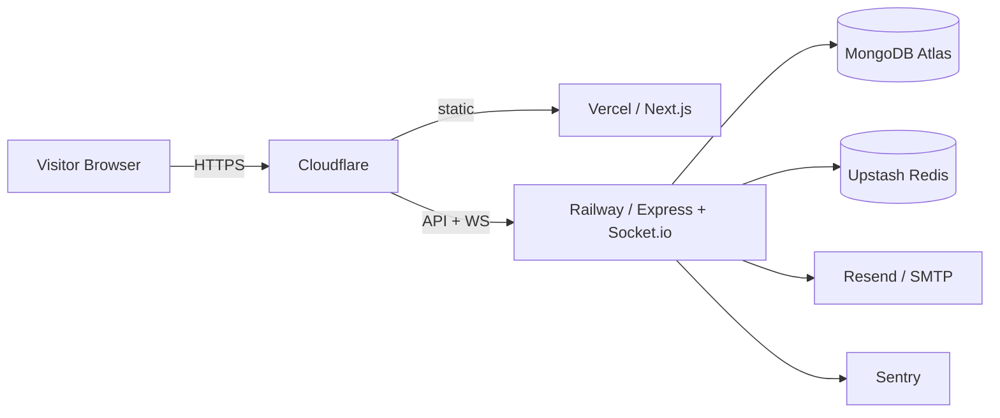
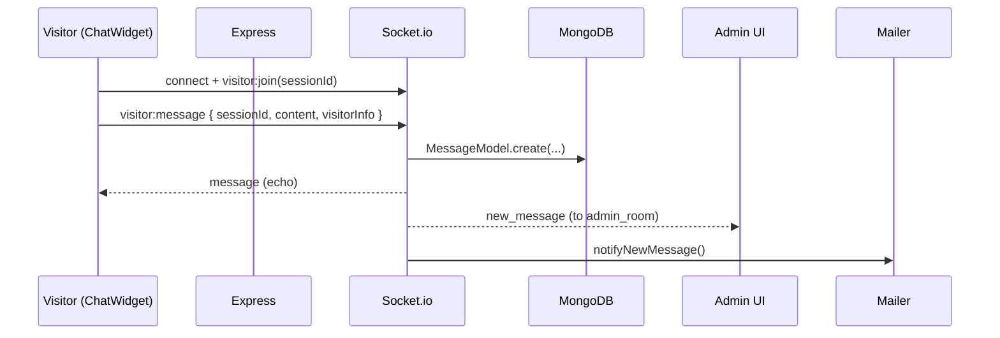

# Architecture

## High-level

## Runtime boundaries

- **Frontend (Vercel)** — Next.js 14 App Router. Statically rendered marketing pages + client
  components for `/admin` and the chat widget. Talks to backend via REST (`/api/*`) and Socket.io.
- **Backend (Railway)** — Node 20 + Express + Socket.io. Long-lived process, stateful WebSocket
  rooms. Scales horizontally once Redis adapter is enabled (Phase 1/5).
- **Shared (`@mojing/shared`)** — Single source of truth for Zod schemas, derived TypeScript types,
  and Socket.io event names. Prevents contract drift between client and server.

## Data flow — visitor message

## Package contracts

| Package    | Depends on       | Purpose                             |
| ---------- | ---------------- | ----------------------------------- |
| `frontend` | `@mojing/shared` | UI + Next routes                    |
| `backend`  | `@mojing/shared` | REST + Socket.io                    |
| `shared`   | —                | Zod schemas, types, event constants |

## Phase roadmap (see root `README.md`)

Phase 0 (current) establishes the engineering baseline. Later phases add security, UI, SEO,
content, chat features, observability, and tests.
