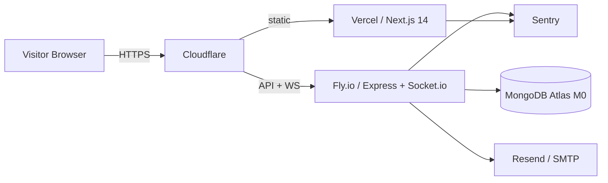
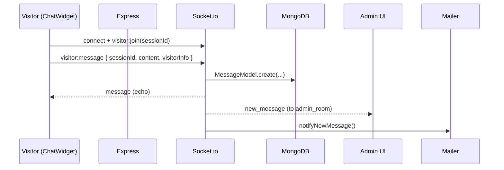

# Architecture

## High-level

## Runtime boundaries

- **Frontend (Vercel Hobby)** — Next.js 14 App Router. Statically rendered marketing pages + client
  components for `/admin` and the chat widget. Talks to backend via REST (`/api/*`) and Socket.io.
  Observability via `@sentry/nextjs`.
- **Backend (Fly.io free tier, `hkg` region)** — Node 20 + Express + Socket.io. Long-lived
  process, stateful WebSocket rooms. V1 runs a single instance; Socket.io Redis adapter is deferred
  to V3 community scaling per ADR-0002 upgrade triggers. Observability via `@sentry/node`.
- **Shared (`@mojing/shared`)** — Single source of truth for Zod schemas, derived TypeScript types,
  and Socket.io event names. Prevents contract drift between client and server.

## Data flow — visitor message

## Package contracts

| Package    | Depends on       | Purpose                             |
| ---------- | ---------------- | ----------------------------------- |
| `frontend` | `@mojing/shared` | UI + Next routes                    |
| `backend`  | `@mojing/shared` | REST + Socket.io                    |
| `shared`   | —                | Zod schemas, types, event constants |

## Roadmap

See [`PROMPT-ENTERPRISE-REBUILD.md`](./PROMPT-ENTERPRISE-REBUILD.md) for the 6-week V1 plan and
[`DECISIONS.md`](./DECISIONS.md) for architectural decisions already taken.
